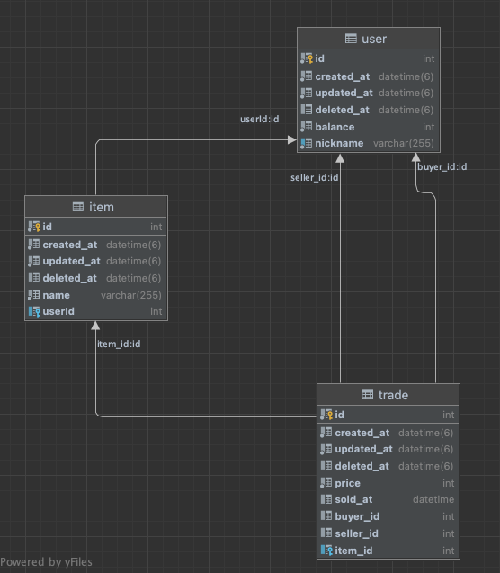

## Using This

Nestjs, TypeORM, Mysql, Typescript

## Installation

```bash
$ npm install
```

## Running the app

```bash
docker-compose up -d # DB/Table 생성 위해 1분 정도 대기

nest start
```

## Description

### 아이템 판매
POST - /trade/sell/item/{itemId}

```json
{
	"price": 1000,
	"sellerId": 1
}
```

### 아이템 구매
POST - /trade/{tradeId}/buy

```json
{
	"buyerId": 1
}
```

### 판매아이템 조회
GET - /trade/item/{itemId}

---

### 응답 성공 시

```json
{
	"code": "0000",
	"message": "성공"
}
```


### 실패 시 응답 예시

```json
{
	"code": "0003",
	"message": "잔액이 충분하지 않습니다."
}
```


## ERD




